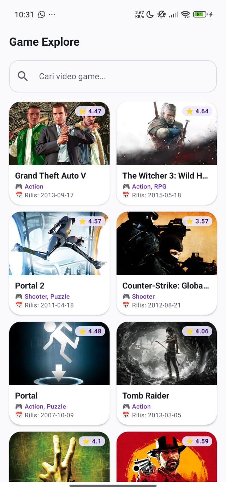
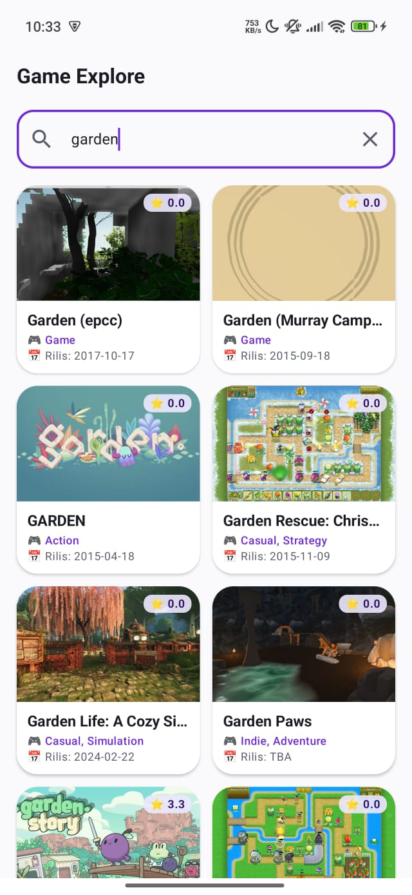
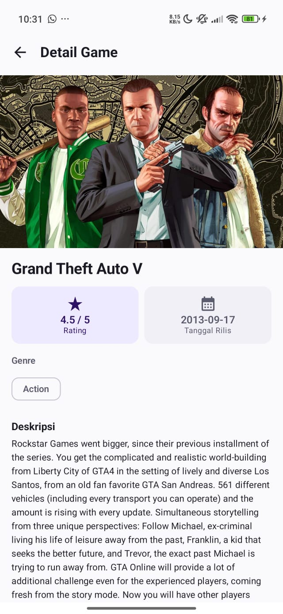
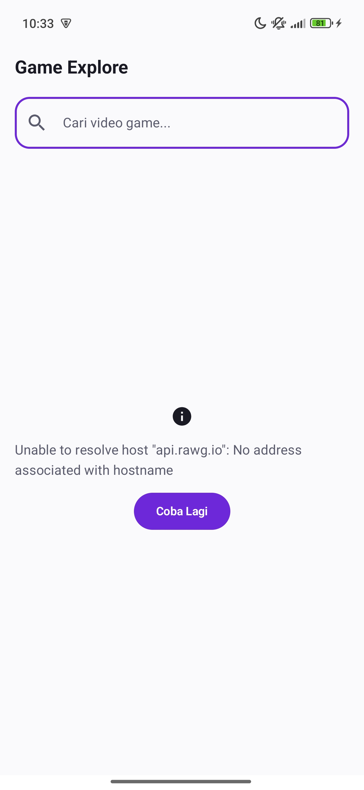
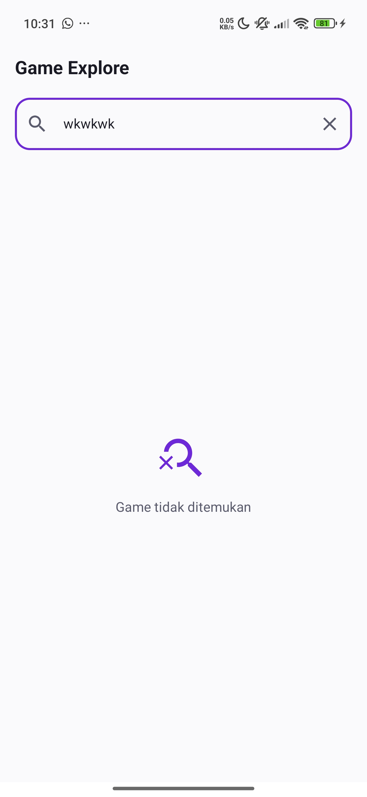

# Game Explore - Katalog & Eksplorasi Video Game

Aplikasi Android untuk menelusuri katalog video game: data diambil **secara dinamis dari
RAWG Video Games Database API** (bukan data hardcode) dan ditampilkan dengan
**Kotlin + Jetpack Compose + Material Design 3**.

Repository: https://github.com/intanayy11/Game-Explore

---

## Screenshots

<table border="1">
  <tr>
    <td align="center" width="30%">
      <b>Preview Home</b><br>
      <b>Home </b><br>
      
    </td>
    <td align="center" width="30%">
      <b>Preview Seacrh</b><br>
      <b>Search</b><br>
      
    </td>
  </tr>
   <tr>
    <td align="center" width="30%">
      <b>Preview Detail Game</b><br>
      <b>Detail Game</b><br>
      
    </td>
    <td align="center" width="30%">
      <b>Error state</b><br>
      <b>Tanpa Koneksi Internet</b><br>
      
    </td>
    <td align="center" width="30%">
      <b>Empty State</b><br>
      <b>Search tidak menemukan data</b><br>
      
    </td>
    <td align="center" width="30%">
      <b>Preview Seacrh</b><br>
      <b>Search</b><br>
      
    </td>
  </tr>
---

## Fitur

**Home Screen**
- Daftar game dari RAWG API memakai `LazyColumn`, tiap kartu menampilkan gambar, judul, rating, dan tanggal rilis (ISO 8601, `YYYY-MM-DD` sesuai spek).
- Search bar: mengetik langsung mengubah state, request ke API ditunda 300 ms (debounce).
- Tiga kondisi UI: loading (spinner), kosong ("Game tidak ditemukan"), error (pesan + tombol Coba Lagi).

**Game Detail Screen**
- Mengambil detail game berdasarkan `id` yang dipilih: banner, judul, rating + bintang, tanggal rilis, genre, dan deskripsi lengkap.
- Tombol back untuk kembali ke Home.

---

## Pemenuhan Persyaratan Teknis

| Persyaratan | Implementasi |
|---|---|
| Kotlin: data class, null safety, lambda | `Game`, `GameResponse`, `Genre` (data class); seluruh field API nullable; lambda pada `clickable`, `joinToString`, `items` |
| Jetpack Compose + Material 3 | Seluruh UI berbasis composable, `MaterialTheme` dengan color scheme custom |
| Theme & typography | `ui/theme/Color.kt`, `Type.kt`, `Theme.kt` (dark & light mode) |
| Lazy layout | `LazyColumn` di `HomeScreen` |
| State & recomposition / search | `mutableStateOf` pada `searchQuery` + `HomeUiState`, debounce 300 ms |
| Networking RAWG | Retrofit 2.11 + Gson, endpoint `/games` dan `/games/{id}` |
| Field wajib | `name`, `rating`, `released` (ISO 8601), `description_raw` |
| Arsitektur MVVM | Retrofit → DTO → `GameRepository` → `GameViewModel` → Composable |
| 2 screen minimum | `HomeScreen`, `GameDetailScreen` |

---

## Arsitektur & Alur Data

```
RAWG API ──► Retrofit (data/remote) ──► DTO (data/model)
                                              │
                                              ▼
                                       GameRepository
                                              │
                                              ▼
                          GameViewModel (sealed UiState + coroutine)
                                              │
                                              ▼
                HomeScreen / GameDetailScreen (Compose, state-driven)
```

**Penjelasan tiap lapisan:**

1. **`data/model/Game.kt`** — data class yang memetakan JSON dari API ke objek Kotlin
   memakai anotasi `@SerializedName` dari Gson. Semua field di-declare **nullable**
   (`String?`, `Double?`, `List<Genre>?`) karena API menandai banyak field opsional
   (deskripsi, gambar, dan tanggal rilis bisa `null`) — inilah penerapan *null safety*.
   `GameResponse` membungkus `results` karena bentuk JSON endpoint list berbeda dari
   endpoint detail.

2. **`data/remote/RawgApiService.kt`** — interface Retrofit berisi dua endpoint:

   ```kotlin
   @GET("games")
   suspend fun getGames(@Query("search") search: String?): GameResponse

   @GET("games/{id}")
   suspend fun getGameDetail(@Path("id") gameId: Int): Game
   ```

   Parameter `key` (API key) dikirim sebagai query parameter pada pemanggilan repository.
   `suspend` berarti pemanggilan berjalan di background thread, sehingga UI tidak freeze.

3. **`data/remote/RetrofitClient.kt`** — objek tunggal (`object` + `by lazy`) yang
   membangun `Retrofit` dengan `GsonConverterFactory` sekali saja.

4. **`data/repository/GameRepository.kt`** — lapisan yang dihubungi ViewModel.
   Repository menyembunyikan detail networking dan menangani `null` pada `results`
   (`?: emptyList()`) supaya ViewModel selalu menerima `List<Game>` yang aman.

5. **`ui/viewmodel/GameViewModel.kt`** — semua business logic:
   - `homeUiState` / `detailUiState` disimpan lewat `mutableStateOf` → Compose otomatis
     recomposition ketika nilainya berubah.
   - Request memakai `viewModelScope.launch` (coroutine), sehingga tidak memblokir thread utama.
   - Pemanggilan API pertama kali terjadi di blok `init`, **bukan** di body composable,
     agar API tidak dipanggil berulang setiap recomposition.
   - Pencarian: `searchQuery` berubah tiap ketikan (recomposition seketika), request ke API
     ditunda 300 ms (**debounce**), dan request id memastikan respons lama yang datang
     belakangan diabaikan (**anti race condition**).

6. **`ui/screen/*`** — composable murni yang hanya membaca `UiState`:

   ```kotlin
   when (uiState) {
       is HomeUiState.Loading -> CircularProgressIndicator()
       is HomeUiState.Success -> LazyColumn { items(games) { ... } }
       is HomeUiState.Error   -> Text(...) + Button("Coba Lagi")
   }
   ```

7. **`ui/navigation/NavGraph.kt`** — `NavHost` dengan dua rute: `home` dan
   `detail/{gameId}`; `gameId` dikirim sebagai `navArgument` bertipe `Int`.
   Sebelum navigasi, `resetDetailState()` dipanggil supaya layar detail tidak sempat
   menampilkan data game yang sebelumnya dibuka.

**Kenapa deskripsi diambil terpisah?**
Endpoint list `/games` tidak menyertakan field deskripsi — hanya endpoint detail
`/games/{id}` yang mengembalikannya. Karena itu `HomeScreen` cukup memanggil `getGames()`,
sedangkan deskripsi diambil ketika user membuka `GameDetailScreen` (`LaunchedEffect(gameId)`).
Deskripsi ditampilkan dari `description_raw` (plain text) sehingga tidak perlu parsing HTML.

---

## Struktur Package

```
com.pemmob.gameexplore
├── data/
│   ├── model/       Game.kt (Game, GameResponse, Genre)
│   ├── remote/      RawgApiService.kt, RetrofitClient.kt
│   └── repository/  GameRepository.kt
├── ui/
│   ├── navigation/  NavGraph.kt
│   ├── screen/      HomeScreen.kt, GameDetailScreen.kt
│   ├── theme/       Color.kt, Type.kt, Theme.kt
│   └── viewmodel/   GameViewModel.kt (HomeUiState, DetailUiState)
├── util/            Constants.kt (BASE_URL, API_KEY), Format.kt (format rating)
├── MainActivity.kt
└── screenshots/     hasil capture untuk README
```

---

## Cara Menjalankan

1. Clone repository ini lalu buka di **Android Studio**.
2. Ambil API key GRATIS di https://rawg.io/apidocs lalu isi di
   `app/src/main/java/com/pemmob/gameexplore/util/Constants.kt` → `API_KEY`.
   <!-- TODO: pindahkan API_KEY ke local.properties + BuildConfig, lalu perbarui bagian ini -->
3. Tunggu Gradle sync selesai (proyek memakai JDK 17).
4. Jalankan pada emulator / perangkat fisik **Android 10 (API 29)** ke atas.
5. Pastikan ada koneksi internet karena seluruh data diambil dari REST API.

Build dari terminal:

```bash
./gradlew assembleDebug      # hasil: app/build/outputs/apk/debug/app-debug.apk
```

---

## Technology Stack

| Komponen | Teknologi |
|---|---|
| Bahasa | Kotlin 2.2 |
| UI | Jetpack Compose + Material Design 3 |
| Navigasi | Navigation Compose |
| Networking | Retrofit 2.11 + Gson converter |
| Gambar | Coil 3 (`AsyncImage`) |
| Async | Kotlin Coroutines + `viewModelScope` |
| Arsitektur | MVVM + Repository pattern |
| API | RAWG Video Games Database — https://api.rawg.io/docs/ |

Data game disediakan oleh [RAWG](https://rawg.io).
